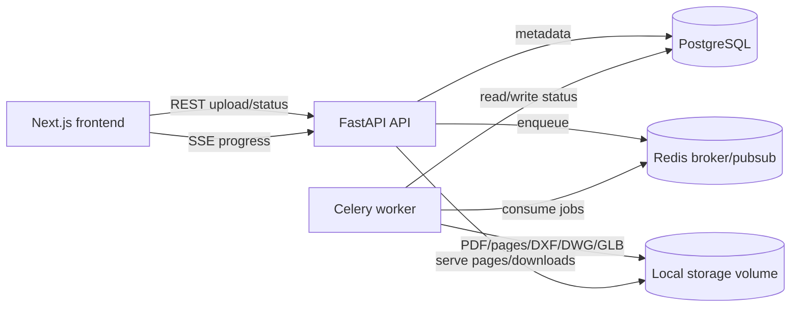

# DrawLift
[](./backend/.python-version)
[](./frontend/package.json)
[](./frontend)
[](./backend)
[](https://github.com/Josh-Uvi/DrawLift/actions/workflows/ci.yml)

> Convert architectural PDF drawings into editable CAD outputs with a FastAPI/Celery conversion pipeline and a Next.js upload, preview, history, and download UI.

DrawLift is a proof-of-concept full-stack application for PDF-to-CAD conversion. Users upload architectural drawings, choose 2D or 3D options, watch progress over Server-Sent Events, preview extracted pages and generated GLB models, then download DXF, optional DWG, or GLB artifacts.

The project is intentionally scoped as a realistic local/dev stack: Next.js frontend, FastAPI API, Celery worker, Redis, PostgreSQL, local file storage, and an operator-supplied DWG converter command when true DWG output is required.

## Table of Contents

- [Security](#security)
- [Background](#background)
- [Install](#install)
- [Usage](#usage)
- [API](#api)
- [Documentation](#documentation)
- [Architecture](#architecture)
- [Development](#development)
- [Contributing](#contributing)

## Security

Do not expose this proof-of-concept directly to untrusted public traffic without adding authentication, quota controls, malware scanning, and production storage hardening.

Current protections include PDF extension/MIME validation, Pydantic config validation, safe page-image path resolution, generated-file download checks, CORS configuration, environment-based secrets, and cleanup of expired job files. See [docs/security.md](./docs/security.md) for the scoped security model, risks, and recommended production controls.

## Background

Architectural PDF drawings often arrive as rasterized plans or mixed vector/raster documents. Turning those drawings into usable CAD is a multi-step process:

1. Render PDF pages into images.
2. Clean and normalize image data.
3. Segment walls, doors, windows, rooms, and text.
4. Vectorize detected features into CAD primitives.
5. Export layered DXF, optionally generate 3D geometry and GLB, and optionally convert DXF to DWG.

DrawLift separates the interactive web workflow from CPU-heavy conversion work. FastAPI handles validation, job metadata, file serving, and SSE. Celery runs the conversion pipeline out of band so long-running conversions do not block HTTP requests.

## Install

### Requirements

- Docker and Docker Compose
- Python 3.11 for host backend development
- Node.js and npm for host frontend development
- Optional: `libredwg`/`dwgwrite` or ODA FileConverter for true DWG output

### Configure

```bash
cp .env.example .env
```

The default Docker Compose stack uses PostgreSQL, Redis, local storage volumes, and `NEXT_PUBLIC_API_URL=http://localhost:8000`.

The default ML runtime now targets the `Yytsi/floorplan-to-3d-walls` Torch
bundle (`best.safetensors` + `config.yaml`). On a fresh Docker models volume,
the backend/worker auto-download the bundle and preload the configured ML
backend at worker startup.

### All-Docker quick start

```bash
make docker-up
make docker-migrate
open http://localhost:3000
```

Useful endpoints:

- Frontend: <http://localhost:3000\>
- Backend health: <http://localhost:8000/api/v1/health\>
- OpenAPI docs: <http://localhost:8000/docs\>

### Hybrid local development

Run PostgreSQL, Redis, and the worker in Docker while running FastAPI and Next.js on the host:

```bash
cd backend
python -m venv .venv
source .venv/bin/activate
pip install -r requirements.txt

cd ../frontend
npm install

cd ..
make local-up
```

Stop services with:

```bash
make local-down
```

## Usage

1. Open <http://localhost:3000\>.
2. Drop or select a PDF file.
3. Choose conversion options:
   - `mode`: `2d` or `3d`
   - `dpi`: render resolution, constrained by backend validation
   - `floor_height_m`, `slab_thickness_m`, and `include_ceiling` for 3D jobs
   - `output_format`: `dxf`, `dwg`, or `both`
   - `segmenter`: `classic` or `ml`
4. Submit the job and watch progress on `/jobs/{id}`.
5. Preview extracted page images and, for 3D jobs, the GLB model.
6. Download available outputs after completion.
7. Use `/history` to filter, reopen, retry failed jobs, or delete jobs.

### Optional DWG conversion

DWG is proprietary, so DrawLift keeps conversion in an optional sidecar. The
`dwg-converter` Compose profile now builds GNU LibreDWG from source and exports
its CLIs to the runtime services through a shared `/opt/libredwg` volume. By
default, Compose auto-configures:

```bash
DWG_CONVERTER_COMMAND='dwgwrite {input} {output}'
```

Supported placeholders are `{input}`, `{output}`, `{input_dir}`, `{output_dir}`, and `{stem}`. Start the sidecar profile with:

```bash
make docker-up-dwg
```

`DwgConverterStep` prefers GNU LibreDWG's `dxf2dwg`, then `dwgwrite`, and falls
back to ODA FileConverter when operators override `DWG_CONVERTER_COMMAND`.

## API

Base path: `/api/v1`.

| Method | Endpoint | Description |
| --- | --- | --- |
| `GET` | `/health` | Liveness/readiness check. |
| `POST` | `/jobs` | Upload a PDF and JSON config as multipart form data. |
| `GET` | `/jobs` | List jobs, newest first, with pagination and optional status filtering. |
| `GET` | `/jobs/{job_id}` | Fetch status, progress, config, timestamps, errors, and page count. |
| `GET` | `/jobs/{job_id}/stream` | Server-Sent Events progress stream backed by Redis Pub/Sub. |
| `GET` | `/jobs/{job_id}/pages/{page_number}` | Serve an extracted page PNG. |
| `GET` | `/jobs/{job_id}/download?format=dxf\|dwg\|glb` | Download completed outputs. |
| `POST` | `/jobs/{job_id}/retry` | Re-enqueue a failed job with its stored input/config. |
| `DELETE` | `/jobs/{job_id}` | Delete job metadata and local job files. |

Example upload:

```bash
curl -X POST http://localhost:8000/api/v1/jobs \
  -F 'file=@floorplan.pdf;type=application/pdf' \
  -F 'config={"mode":"3d","dpi":300,"floor_height_m":3.0,"output_format":"both","segmenter":"classic"}'
```

See [docs/api.md](./docs/api.md) for payloads, status semantics, and edge cases.

## Documentation

Important content from the previous README, TODO, and implementation plan has been split into focused documents:

- [Architecture](./docs/architecture.md) — system boundaries, diagrams, data flow, job lifecycle.
- [API](./docs/api.md) — REST/SSE contract and examples.
- [Pipeline](./docs/pipeline.md) — conversion stages, config, outputs, and edge cases.
- [Design system](./docs/design-system.md) — frontend conventions, tokens, shared components, accessibility.
- [Security](./docs/security.md) — scoped controls, concerns, and production hardening.
- [Trade-offs and alternatives](./docs/trade-offs-and-alternatives.md) — decision log and alternatives considered.
- [Risks and edge cases](./docs/risks-and-edge-cases.md) — realistic operational and product risks.
- [Operations](./docs/operations.md) — setup, service management, tests, migrations, cleanup.
- [Roadmap](./docs/roadmap.md) — distilled project stages from `TODO.md` and implementation plan.

`TODO.md` remains the detailed issue-tracking source of truth for user stories and historical progress.

## Architecture



The worker composes pluggable pipeline steps: PDF parsing, preprocessing, segmentation, vectorization, optional extrusion, DXF writing, optional GLB writing, and optional DWG conversion.

## Development

Common quality checks:

```bash
cd backend
ruff check .
ruff format --check .
mypy app/
pytest

cd ../frontend
npm run lint
npm run format:check
npm run build

# root hooks (frontend deps auto-bootstrap if missing)
cd ..
pre-commit run --all-files
```

Root service commands:

```bash
make help
make docker-up
make docker-down
make local-up
make local-status
make logs-worker
make download-model
make validate-model
```

## Contributing

Issues, branches, and PRs are managed in GitHub. Use the user-story and issue conventions documented in [TODO.md](./docs/TODO.md) and the delivery summary in [docs/roadmap.md](./docs/roadmap.md).

Before opening a PR:

1. Keep changes scoped to one issue or concern.
2. Run relevant backend/frontend checks.
3. Update docs when behavior, commands, API payloads, or trade-offs change.
4. Reference the GitHub issue in the branch name or PR body where applicable.
