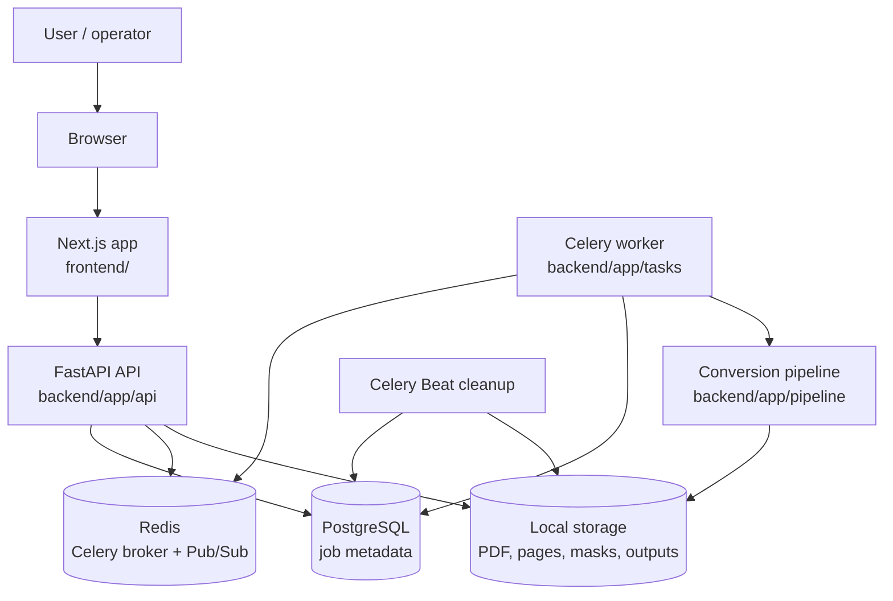
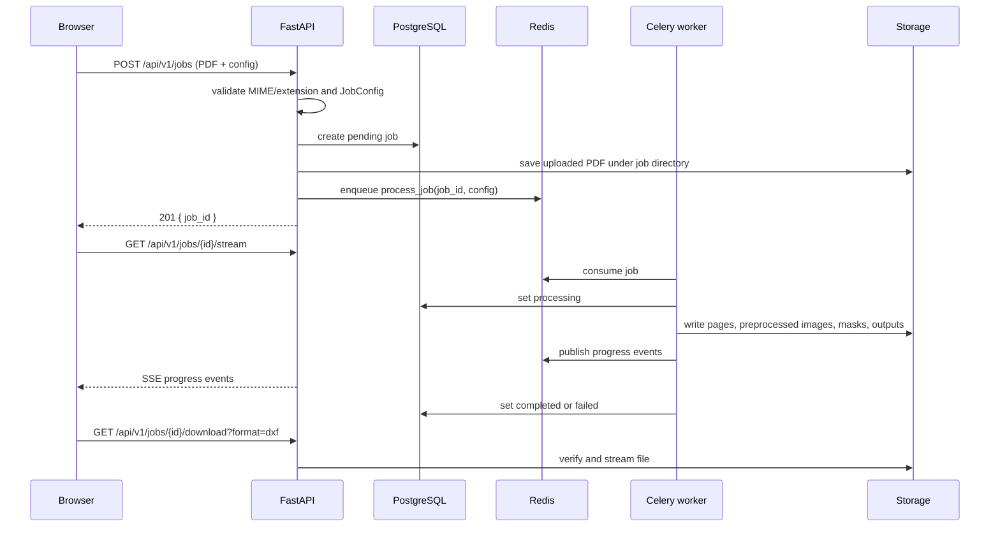

# Architecture

DrawLift is a decoupled PDF-to-CAD conversion app. The frontend owns the user workflow, the FastAPI service owns validation and job metadata, and Celery workers own long-running conversion.

## System context



## Runtime services

| Service | Source | Responsibility |
| --- | --- | --- |
| `frontend` | `frontend/` | Next.js UI for upload, job detail, history, retry, downloads, and 3D preview. |
| `backend` | `backend/app/main.py` | FastAPI routes, OpenAPI docs, CORS, error handling, DB sessions. |
| `worker` | `backend/app/tasks/placeholder.py` | Celery task that runs the real conversion pipeline. |
| `beat` | `backend/app/tasks/cleanup.py` | Daily cleanup/archive scheduler. |
| `postgres` | Docker image | Job metadata, config JSON, progress, errors, timestamps. |
| `redis` | Docker image | Celery broker/result backend and progress Pub/Sub. |
| `dwg-converter` | optional Compose profile | Placeholder sidecar for operator-supplied DWG tooling. |

## Job lifecycle



The worker publishes an initial `processing` event as soon as it claims the job, per-step events during the pipeline, and a terminal `completed` or `failed` event. The SSE endpoint closes the stream on either terminal status. The frontend also polls `GET /jobs/{id}` every 3 seconds as a fallback because Redis Pub/Sub does not replay events to late subscribers.

## Data model

The core table is `jobs`, managed by Alembic migrations under `backend/alembic/versions/`.

Key fields:

- `id`: UUID primary key.
- `status`: `pending`, `queued`, `processing`, `completed`, `failed`, or `archived`.
- `progress`: integer percentage.
- `step`: current user-facing step.
- `config`: JSONB conversion config.
- `input_file` / `output_file`: storage paths.
- `page_count`: number of rendered PDF pages.
- `error_msg` / `error_trace`: failed-job diagnostics.
- `created_at` / `updated_at`: ordering and lifecycle metadata.

## File layout

Each job writes under a job-specific storage directory:

```text
storage/{job_id}/
├── input.pdf
├── pages/page_0001.png
├── preprocessed/...
├── masks/...
└── output/
    ├── output.dxf
    ├── output.dwg   # when configured and converter succeeds
    └── output.glb   # for 3D jobs
```

The exact persisted path can be relative in hybrid local development so the host API and Docker worker can both resolve completed outputs.

## Boundaries

- The frontend does not run conversion logic; it only uploads, polls/fetches, subscribes to SSE (with a polling fallback), previews, and downloads.
- Celery task modules are registered explicitly via the `include` setting in `backend/app/tasks/celery_app.py`; a task module that is not listed there will not be executable by the worker.
- FastAPI does not perform heavy conversion in request handlers; it creates jobs and serves files/status.
- Pipeline steps are pluggable and operate on `PipelineContext`.
- DWG generation is intentionally externalized because DWG is proprietary.
