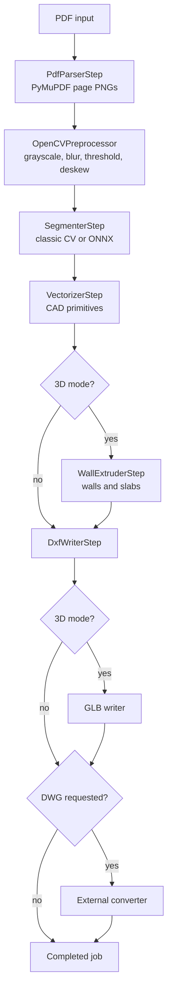

# Conversion Pipeline

The conversion pipeline runs in the Celery worker and is composed of ordered, pluggable steps from `backend/app/pipeline/steps`.

## Pipeline context

`PipelineContext` carries state between steps:

- `job_id`
- `input_path`
- `config`
- `page_images`
- `preprocessed`
- `masks`
- `primitives`
- `output_path`
- `metadata`
- `progress_publisher`

## Stages

## Step responsibilities

| Step | File | Responsibility | Typical progress |
| --- | --- | --- | --- |
| PDF parsing | `pdf_parser.py` | Render each PDF page to PNG at configured DPI. | 20% |
| Preprocessing | `preprocessor.py` | Convert to grayscale/binary arrays, denoise, threshold, deskew. | 35% |
| Segmentation | `segmenter.py` | Produce masks for walls, doors, windows, rooms, and text. | 60% |
| Vectorization | `vectorizer.py` | Convert masks into wall/opening/room/text primitives. | 80% |
| 3D extrusion | `extruder.py` | Create wall solids and slab primitives for 3D jobs. | 85% |
| DXF writing | `dxf_writer.py` | Write layered 2D/3D DXF via `ezdxf`. | 95% |
| GLB writing | `glb_writer.py` | Export self-contained GLB for browser preview and download. | 97% |
| DWG conversion | `dwg_converter.py` | Run configured external converter command. | 98% |

## Progress reporting

The task publishes progress through Redis Pub/Sub on channel `job:{job_id}`:

1. `processing` / 0% / `Starting` as soon as the worker claims the job.
2. One event per step (see Typical progress above) as each step completes.
3. `completed` / 100% or `failed` with the error message as the terminal event.

The FastAPI SSE endpoint forwards these events and closes the stream on `completed` or `failed`. The job page also polls the REST API every 3 seconds, so progress stays visible even if the browser subscribed after some events were published.

The task also logs lifecycle lines (`Job {id}: starting conversion`, `running pipeline with N step(s)`, `pipeline completed successfully`, or `pipeline failed`) to the worker log.

## Output layers and artifacts

DXF outputs use domain-oriented layers such as:

- `WALLS`
- `DOORS`
- `WINDOWS`
- `ROOMS`
- `TEXT`
- `WALLS_3D`
- `SLABS`

3D jobs also produce `output.glb`. DWG jobs produce `output.dwg` only when `DWG_CONVERTER_COMMAND` is configured and succeeds.

## Segmenter options

- `classic`: deterministic OpenCV path. It is faster and suitable for simple, high-contrast line drawings.
- `ml`: ONNX Runtime path. It is intended for richer plans but depends on configured model files or model download settings.

### Segmenter status (as of 2026-08)

| Aspect | `classic` | `ml` |
| --- | --- | --- |
| Walls | ✅ Detected via Canny + Hough lines | ⚠️ Requires ONNX model (not yet bundled) |
| Doors | ❌ Always zero mask | ⚠️ Requires ONNX model |
| Windows | ❌ Always zero mask | ⚠️ Requires ONNX model |
| Rooms | ✅ Derived from wall mask regions | ⚠️ Requires ONNX model |
| Text | ❌ Always zero mask | ⚠️ Requires ONNX model |

The `classic` segmenter uses thresholding, Canny edges, and probabilistic Hough line detection. It detects wall structures but emits zero-filled masks for doors, windows, and text. This means downstream vectorization and DXF output are structurally valid but semantically incomplete for real architectural drawings.

The `ml` segmenter supports ONNX Runtime inference and will produce all five mask classes when a suitable model is configured. **No model file currently exists in `backend/models/`** and both `SEGMENTER_MODEL_PATH` and `SEGMENTER_MODEL_URL` are unset. See [Stage 6 in TODO.md](./TODO.md) for the model acquisition plan.

Recommended lightweight open-source models for floor-plan segmentation:

| Model | Source | Size | Notes |
| --- | --- | --- | --- |
| CubiCasa5K SegFormer | [HuggingFace](https://huggingface.co) | ~85 MB | 12 classes incl. walls, doors, windows, rooms, text. Best accuracy. |
| FloorPlan-Segmentation-UNet | [AIVenture0/FloorPlan-Segmentation-UNet](https://huggingface.co/AIVenture0/FloorPlan-Segmentation-UNet) | ~30 MB | 8 classes. Lightweight U-Net. |
| R2CNN Floor Plan | [luan1412167/r2cnn-floorplan](https://huggingface.co/luan1412167/r2cnn-floorplan) | ~50 MB | Wall/room/door/window detection. |

## Edge cases handled or expected

- Multi-page PDFs write numbered page images and persist `page_count`.
- 3D-only fields are accepted in config even when mode is `2d`; they are ignored by non-3D steps.
- DWG conversion failures surface as failed jobs with `error_msg` and `error_trace`.
- Worker retries are configured with exponential backoff, but deterministic input/config errors will fail repeatedly until changed.

## Known limitations

- Output quality depends heavily on input drawing quality and segmentation accuracy.
- The current storage adapter is local filesystem oriented.
- True DWG generation is a post-processing conversion from DXF, not a native DWG writer.
- The pipeline is synchronous inside a Celery task; parallel page processing is a future optimization.
- **No ML segmentation model is bundled.** The `backend/models/` directory is empty. Jobs using `segmenter: "ml"` will fail until a model is downloaded and configured via `SEGMENTER_MODEL_PATH` or `SEGMENTER_MODEL_URL`.
- **DWG conversion requires an external binary.** The `dwg-converter` Compose profile is a placeholder. A `libredwg` sidecar Docker image (providing `dwgwrite`) should be built and wired into the profile for DXF→DWG support.
