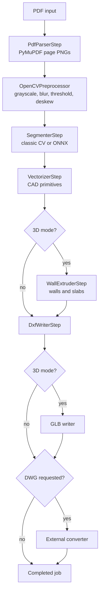

# Conversion Pipeline

The conversion pipeline runs in the Celery worker and is composed of ordered, pluggable steps from `backend/app/pipeline/steps`.

## Pipeline context

`PipelineContext` carries state between steps:

- `job_id`
- `input_path`
- `config`
- `page_images`
- `preprocessed`
- `masks`
- `primitives`
- `output_path`
- `metadata`
- `progress_publisher`

## Stages

## Step responsibilities

| Step | File | Responsibility | Typical progress |
| --- | --- | --- | --- |
| PDF parsing | `pdf_parser.py` | Render each PDF page to PNG at configured DPI. | 20% |
| Preprocessing | `preprocessor.py` | Convert to grayscale/binary arrays, denoise, threshold, deskew. | 35% |
| Segmentation | `segmenter.py` | Produce masks for walls, doors, windows, rooms, and text. | 60% |
| Vectorization | `vectorizer.py` | Convert masks into wall/opening/room/text primitives. | 80% |
| 3D extrusion | `extruder.py` | Create wall solids and slab primitives for 3D jobs. | 85% |
| DXF writing | `dxf_writer.py` | Write layered 2D/3D DXF via `ezdxf`. | 95% |
| GLB writing | `glb_writer.py` | Export self-contained GLB for browser preview and download. | 97% |
| DWG conversion | `dwg_converter.py` | Run configured external converter command. | 98% |

## Progress reporting

The task publishes progress through Redis Pub/Sub on channel `job:{job_id}`:

1. `processing` / 0% / `Starting` as soon as the worker claims the job.
2. One event per step (see Typical progress above) as each step completes.
3. `completed` / 100% or `failed` with the error message as the terminal event.

The FastAPI SSE endpoint forwards these events and closes the stream on `completed` or `failed`. The job page also polls the REST API every 3 seconds, so progress stays visible even if the browser subscribed after some events were published.

The task also logs lifecycle lines (`Job {id}: starting conversion`, `running pipeline with N step(s)`, `pipeline completed successfully`, or `pipeline failed`) to the worker log.

## Output layers and artifacts

DXF outputs use domain-oriented layers such as:

- `WALLS`
- `DOORS`
- `WINDOWS`
- `ROOMS`
- `TEXT`
- `WALLS_3D`
- `SLABS`

3D jobs also produce `output.glb`. DWG jobs produce `output.dwg` only when `DWG_CONVERTER_COMMAND` is configured and succeeds.

## Segmenter options

- `classic`: deterministic OpenCV path. It is faster and suitable for simple, high-contrast line drawings.
- `ml`: ONNX Runtime path. It is intended for richer plans but depends on configured model files or model download settings.

### Segmenter status (as of 2026-08)

| Aspect | `classic` | `ml` |
| --- | --- | --- |
| Walls | ✅ Detected via Canny + Hough lines | ✅ Default Yytsi Torch bundle predicts walls |
| Doors | ❌ Always zero mask | ✅ Default Yytsi Torch bundle predicts doors |
| Windows | ❌ Always zero mask | ✅ Default Yytsi Torch bundle predicts windows |
| Rooms | ✅ Derived from wall mask regions | ✅ Derived from Yytsi structural masks |
| Text | ❌ Always zero mask | ✅ Heuristically recovered from residual foreground |

The `classic` segmenter uses thresholding, Canny edges, and probabilistic Hough line detection. It detects wall structures but emits zero-filled masks for doors, windows, and text. This means downstream vectorization and DXF output are structurally valid but semantically incomplete for real architectural drawings.

The `ml` segmenter now supports both ONNX Runtime inference and Torch bundle inference via `AutoMlSegmenter`. Docker/runtime defaults target the `Yytsi/floorplan-to-3d-walls` bundle (`best.safetensors` + `config.yaml`), which predicts four structural classes and is bridged back to the pipeline's stable five-label contract by deriving `rooms` and heuristically provisioning `text`. The legacy `backend/models/semantic_segmenter.onnx` reference model remains available as a compatibility fallback and for contract-validation utilities. `.env.example` and `docker-compose.yml` set `SEGMENTER_MODEL_PATH`, `SEGMENTER_MODEL_CONFIG_PATH`, `SEGMENTER_MODEL_URL`, and `SEGMENTER_MODEL_CONFIG_URL` by default; Celery workers preload whichever backend is configured via the `worker_process_init` handler. See [Stage 6 in TODO.md](./TODO.md) for the model acquisition plan.

## Classic vs ML segmentation comparison

US-031 adds a reproducible comparison helper (`app.ml.comparison.compare_segmenters`) and fixture-driven tests so classic-vs-ML quality claims are backed by measured coverage instead of anecdotes.

Representative sample: a 240×320 floor plan containing exterior/interior walls, a door swing arc, a double-line window opening, and text-like room labels.

| Label | Classic px | Classic % | ML px | ML % | ML blobs (>=12 px²) |
| --- | ---: | ---: | ---: | ---: | ---: |
| walls | 13179 | 17.16 | 17554 | 22.86 | 4 |
| doors | 0 | 0.00 | 7826 | 10.19 | 13 |
| windows | 0 | 0.00 | 8033 | 10.46 | 13 |
| rooms | 37993 | 49.47 | 59203 | 77.09 | 9 |
| text | 0 | 0.00 | 5055 | 6.58 | 10 |

Observations:

- The `classic` backend still provides structurally useful wall masks, but it cannot emit door, window, or text masks, so downstream DXF output lacks those semantic entities.
- The default Yytsi-backed `ml` path activates all five labels on the same drawing and produces multiple vectorizable connected components for doors, windows, and text.
- With the same fixture routed through the full PDF→DXF pipeline, the ML path emits entities on `DOORS`, `WINDOWS`, `ROOMS`, and `TEXT` layers; the classic path emits only `WALLS`.
- The ONNX reference model remains available for contract validation, but the default Docker/runtime ML path now uses the trained Yytsi structural model with backend-specific post-processing for rooms/text. These numbers therefore prove the **5-label contract and DXF-layer plumbing**, while still depending on heuristic bridging for the two non-structural classes.

Recommended lightweight open-source models for floor-plan segmentation:

| Model | Source | Size | Notes |
| --- | --- | --- | --- |
| CubiCasa5K SegFormer | [HuggingFace](https://huggingface.co) | ~85 MB | 12 classes incl. walls, doors, windows, rooms, text. Best accuracy. |
| FloorPlan-Segmentation-UNet | [AIVenture0/FloorPlan-Segmentation-UNet](https://huggingface.co/AIVenture0/FloorPlan-Segmentation-UNet) | ~30 MB | 8 classes. Lightweight U-Net. |
| R2CNN Floor Plan | [luan1412167/r2cnn-floorplan](https://huggingface.co/luan1412167/r2cnn-floorplan) | ~50 MB | Wall/room/door/window detection. |

## Edge cases handled or expected

- Multi-page PDFs write numbered page images and persist `page_count`.
- 3D-only fields are accepted in config even when mode is `2d`; they are ignored by non-3D steps.
- DWG conversion failures surface as failed jobs with `error_msg` and `error_trace`.
- Worker retries are configured with exponential backoff, but deterministic input/config errors will fail repeatedly until changed.

## Known limitations

- Output quality depends heavily on input drawing quality and segmentation accuracy.
- The current storage adapter is local filesystem oriented.
- True DWG generation is a post-processing conversion from DXF, not a native DWG writer.
- The pipeline is synchronous inside a Celery task; parallel page processing is a future optimization.
- **The bundled ML segmentation model is a reference implementation.** `backend/models/semantic_segmenter.onnx` is a small deterministic edge-energy model that satisfies the 5-class output contract but is not trained on floor plans. Swap in trained weights with `make download-model MODEL_URL=<url>` or `SEGMENTER_MODEL_URL`; artifacts are contract-validated on provisioning.
- **DWG conversion is now sidecar-based.** The optional `dwg-converter` Compose profile builds GNU LibreDWG from source and shares `/opt/libredwg` with the runtime services. `DwgConverterStep` prefers LibreDWG's `dxf2dwg`, then `dwgwrite`, and finally ODA FileConverter if configured manually.
